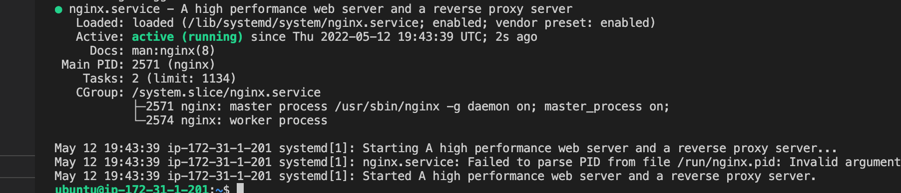
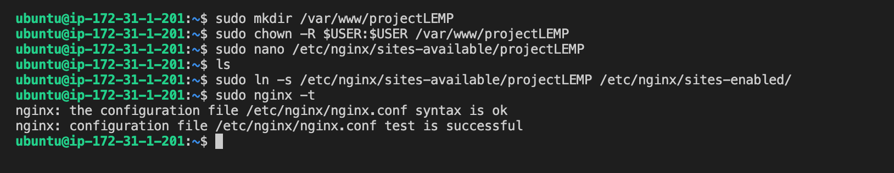
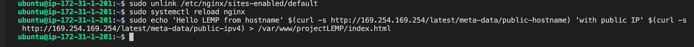
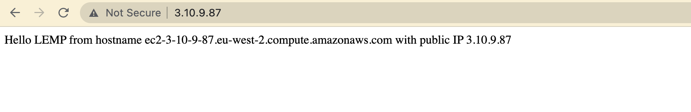

# Aker-Systems-Project-2-LEMP-Stack-Implementation


## Intro

In this project, I will employ a LAMP  (Linux, Nginx, MySQL, PHP) stack project in an amazon EC2 instance. Here are the steps I took to implement this.


### Initiate EC2 & Install nginx

- An aws ec2 was started and following command was run to install nginx, `sudo apt update && sudo apt install nginx && sudo systemctl status nginx`. 
- Nginx is active and running, html can also seen below when accessed locally via `curl http://127.0.0.1:80`.
- This was also tested on the browser and yeiled successfull results, the inbound security groups were changed to alllow http get this working.





### MySQL Install

- Next we move on to our DMB install, and we do that via `sudo apt install mysql-server`, we then access this through `sudo mysql` to ensure this is successfull.


### Installing PHP

- PHP was installed and checked via `sudo apt install php libapache2-mod-php php-mysql`, and `php -v` respectively.


### Configure nginx to use php processor

- Firstly we are going to create a root web directory for our domain called projectLEMP. This was done through `sudo mkdir /var/www/projectLEMP`, along with assigning the ownership to the system user via `sudo chown -R $USER:$USER /var/www/projectLEMP`.
- Next we created our configuration file within sites-directory via vim using the command `sudo vim /etc/nginx/sites-available/projectLEMP`.

- In the configuration file we placed the following configuration seen below.

```
#/etc/nginx/sites-available/projectLEMP

server {
    listen 80;
    server_name projectLEMP www.projectLEMP;
    root /var/www/projectLEMP;

    index index.html index.htm index.php;

    location / {
        try_files $uri $uri/ =404;
    }

    location ~ \.php$ {
        include snippets/fastcgi-php.conf;
        fastcgi_pass unix:/var/run/php/php7.4-fpm.sock;
     }

    location ~ /\.ht {
        deny all;
    }

}
```
- We then activate our configuration, by linking it from the sites-available directory `sudo ln -s /etc/nginx/sites-available/projectLEMP /etc/nginx/sites-enabled/`.





- Finally we disable the default host thats listening on port 80, to then create a html file for your site. A reload of nginx is required to kick start everything. The commands can be seen below.

```
sudo unlink /etc/nginx/sites-enabled/default
sudo systemctl reload nginx
sudo echo 'Hello LEMP from hostname' $(curl -s http://169.254.169.254/latest/meta-data/public-hostname) 'with public IP' $(curl -s http://169.254.169.254/latest/meta-data/public-ipv4) > /var/www/projectLEMP/index.html
```



